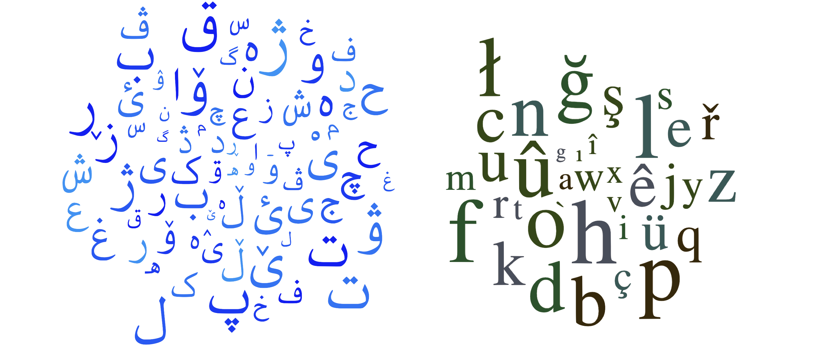

# Language Identification of Kurdish & Zaza-Gorani Languages



Language identification or detection is the task of detecting the language in which a sentence is written. This repository provides models for language identificaiton of Kurdish and Zaza-Gorani languages with their Kurdified Perso-Arabic and Latin scripts. Our models can predict the following languages and scripts:

* Northern Kurdish / کورمانجی (Kurmanji, `kmr`) - both scripts with `kuarab` & `kulatn` labels
* Central Kurdish / سۆرانی (Sorani, `ckb`) - both scripts with `ckbarab` & `ckblatn` labels
* Southern Kurdish / کوردیی خوارین (`sdh`) 
* Gorani / گۆرانی (Hawrami, `hac`)
* Zazaki / Zazakî / (`zza`) - both scripts with `zza` for Bedirxan and `zzawiki` for the script used on [Zazaki Wikipedia](https://diq.wikipedia.org)
* Arabic / اَلْعَرَبِيَّةُ (`ar`)
* Persian / فارسی (`fa`)
* Turkish / Türkçe / (`tr`)

## How to use?

Our [models](models) are trained using `fastText`. You can run the models in Python or on command-line by installing the `fastText`library as described at [https://fasttext.cc/docs/en/support.html](https://fasttext.cc/docs/en/support.html).

Two models are provided:

* [models/KLID_model.ftz](models/KLID_model.ftz): use this if you don't mind about detecting the script of the language. This predicts language codes only.
* [models/KLID_model_scr.ftz](models/KLID_model_scr.ftz): use this if you want the script label in addition to the language code. This predicts language and script.

Here is an example in Python:

```python
>>> import fasttext
>>> model = fasttext.load_model("models/KLID_model.ftz")

# Central Kurdish
>>> model.predict("لەزۆربەی یارییەکان گوڵ تۆمار دەکات") 
(('__label__ckb',), array([1.00002003]))
>>> model.predict("لەزۆربەی یارییەکان گوڵ تۆمار دەکات", k=5)
(('__label__ckb', '__label__ku'), array([1.00002003e+00, 1.00000989e-05]))
>>> model.predict("لەزۆربەی یارییەکان گوڵ تۆمار دەکات")
(('__label__ckb',), array([1.00002003]))
>>> model.predict("باڵیۆزی عێراق")
(('__label__ckb',), array([1.00001979]))

# Southern Kurdish
>>> model.predict("چەس ئمڕوو چە قوومیاس؟!!") 
(('__label__sdh',), array([1.00003743]))

# Gorani
>>> model.predict("داستانێ فرەتەر و درێژتەرەنه و دەسی سەر پەی") 
(('__label__hac',), array([0.99998134]))

# Kurmanji
>>> model.predict("ئەگەر بێژم ئەز فەرهادم") 
(('__label__ku',), array([0.93445575]))

# Zazaki
>>> model.predict("Seba naye zî ganî ma rayîr û metodanê xo xurtêr bikerê.") 
(('__label__zza',), array([1.00003004]))

# Northern Kurdish
>>> model.predict("Amerîkayîyan di sala 2004 de zîndana Ebû Xerîb girtin.") 
(('__label__ku',), array([0.99766862]))

# Central Kurdish
>>> model.predict("Emin filsêkim le kitêban dest nekewtbû bełam") 
(('__label__ckb',), array([1.00001991]))

# Central Kurdish
>>> model.predict("گەرەکمە پێی بێژم نامگەرەکە") 
(('__label__ku',), array([0.99485904])) 
>>> model.predict("جا ئەتوو وەرە دەگەڵ وی ڕێک کەوە")
(('__label__sdh',), array([0.84034669])) 

# English
>>> model.predict("To be, or not to be") 
(('__label__zza',), array([1.00003004]))
```

If you would like to train your own models, you can use the datasets provided in the [datasets](datasets) folder. All the datasets are merged into [train](datasets/train.txt) and [train_scr](datasets/train.txt); these two files refer to the instances tagged without and with their scripts, respectively.

## Cite this corpus
If you're using the models, please cite the project along with the following paper ([bib file](https://sinaahmadi.github.io/bibliography/ahmadi2023fieldmatters.bib) | [PDF](https://sinaahmadi.github.io/docs/articles/ahmadi2023fieldmatters.pdf)). 

```
@inproceedings{ahmadi2023fieldmatters,
  title = "Approaches to Corpus Creation for Low-Resource Language Technology: the Case of {Southern Kurdish and Laki}",
  author = "Ahmadi, Sina and Azin, Zahra and Belelli, Sara and Anastasopoulos, Antonios",
  booktitle = "Proceedings of the second workshop on NLP applications to field linguistics",
  month = may,
  year = "2023",
  address = "Dubrovnik, Croatia",
  publisher = "The 17th Conference of the European Chapter of the Association for Computational Linguistics"
}
```

## License

[MIT](LICENSE)
